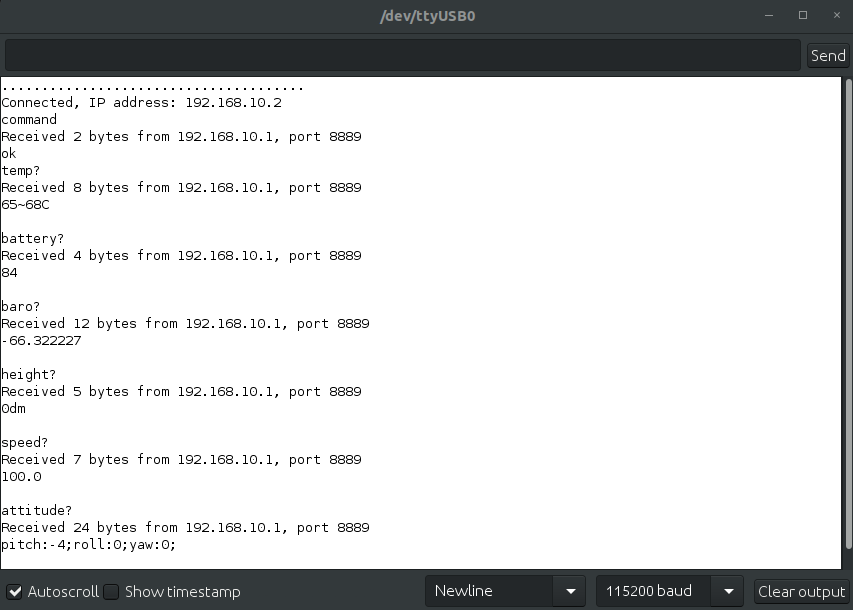
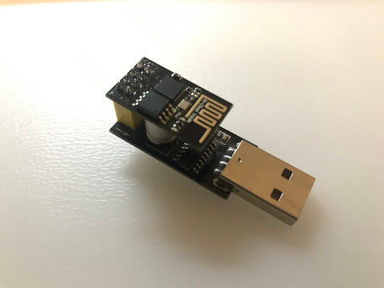

#Tello Drone Serial Terminal with ESP8266

Tello is a great drone for programmers, provides an SDK that allows to command the drone over UDP messages.
When the Tello is powered, creates an access point, you need to connect to it to be able to communicate...not a good option, if you are connected to the internet ower Wifi.

Using a small ESP8266 - ESP-01 module and a serial programmer, this can be bridged. This project creates a UDP to serial translation/communication to the Tello.


<p align="center"> 
  </a>
  </a>
</p>

## How to use

1. Edit the following parameters in the *.ino file
```
const String telloIP = "192.168.10.1";                 /*tello IP*/
const String tello_SSID = "<TELLO SSID name>";         /*name of the tello access point*/
const String tello_SSID_pass = "<TELLO Password>";     /*name of the tello access point*/
```
2. Open Arduino Studio, write the *.ino file, reset
3. Open a serial terminal (HTerm, Arduino integrated one)...That's it.

## Links
[Tello SDK 1.3.0.0](https://dl-cdn.ryzerobotics.com/downloads/tello/20180910/Tello%20SDK%20Documentation%20EN_1.3.pdf)

[Tello SDK 2.0](https://dl-cdn.ryzerobotics.com/downloads/Tello/Tello%20SDK%202.0%20User%20Guide.pdff)


/Enjoy.
